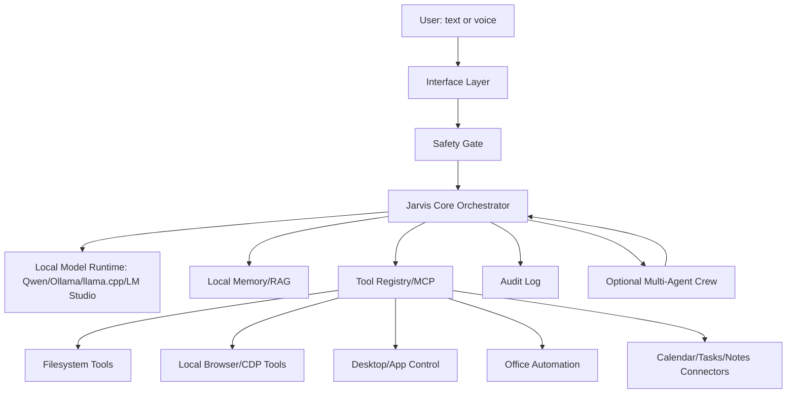

# Architecture

## System Overview



## Components

### Interface Layer

Interfaces should be added in this order:
1. CLI text loop.
2. Local web UI on loopback.
3. Push-to-talk voice.
4. Wake-word voice.
5. Screen overlay or tray assistant.

Reason: text is easiest to debug and safest to audit.

### Safety Gate

The safety gate decides whether a request can proceed:
- Is the target local and in scope?
- Does it require network?
- Does it read secrets?
- Does it modify files or app state?
- Is the action destructive or high impact?
- Is explicit approval required?

### Jarvis Core Orchestrator

Responsibilities:
- Maintain conversation state.
- Classify intent.
- Select model profile.
- Retrieve memory.
- Select tools.
- Ask for approval when needed.
- Verify outputs.
- Write audit events.
- Route to subagents only when beneficial and authorized.

### Local Model Runtime

The runtime exposes a local endpoint. Preferred shape:
- `POST /api/chat` for chat.
- `POST /api/generate` for completion.
- OpenAI-compatible `/v1/chat/completions` if available.

Model profiles:
- Fast: small Qwen model for quick commands.
- Balanced: mid-size Qwen instruct model.
- Coder: Qwen coder model.
- Critic: same or stronger model with reviewer prompt.

### Memory/RAG

Memory tiers:
- Session memory: current conversation.
- Task memory: temporary summaries and artifacts.
- Long-term memory: user-approved facts and preferences.
- Project memory: repo conventions, local setup, reusable notes.

Every long-term memory item should have:
- Source.
- Timestamp.
- Confidence.
- Expiry or review policy.

### Tool Registry/MCP

Every tool has:
- Name.
- Description.
- Input schema.
- Side-effect class.
- Permission requirement.
- Dry-run support where relevant.
- Redaction policy.
- Error contract.

### Multi-Agent Crew

Optional specialists:
- Researcher.
- Coder.
- Browser inspector.
- Office/document worker.
- Local system diagnostician.
- Verifier/critic.

Coordinator rule:
- The core orchestrator remains accountable for task decomposition, integration, and final response.

## Data Flow

1. User speaks or types.
2. Interface normalizes input.
3. Safety gate labels risk.
4. Orchestrator builds compact context.
5. Model proposes answer, tool call, or clarification.
6. Safety gate validates tool call.
7. Tool executes if allowed.
8. Orchestrator verifies result.
9. Response is returned.
10. Audit log records safe summary.

## Local Storage Layout

Recommended runtime storage:

```text
~/.local-jarvis/
  config/
  memory/
  logs/
  artifacts/
  models/
  tmp/
```

Inside this repo, keep only templates, examples, and non-sensitive validation artifacts.

